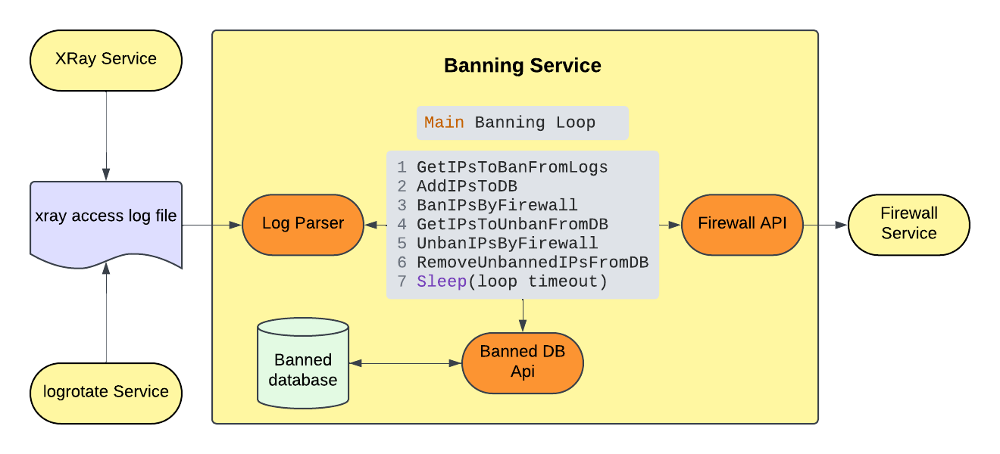

## Что это

Приложение, которое позволяет банить пользователей вашего [xray vpn](https://github.com/xtls/xray-core) сервера за, например, использование torrent-трекеров.

## В чём проблема

Скачивание торрентов через ваш VPN-сервер – это всегда проблема. Рост нагрузки, рост траффика, письма с угрозами от правообладателя - никто не будет этому рад.

XRay ограниченно способен детектировать такую активность и блокировать часть таких пакетов, но далеко не все. Для этого требуется создать вот такой outbound и routing rule:

```json
   "outbounds": [                                                             
      ...
      {
        "tag": "blacklist",
        "protocol": "blackhole"
      }
    ],
    "routing": {
      "rules": [
        {
          "type": "field",
          "protocol": "bittorrent",
          "outboundTag": "blacklist"
        },
        ...
    }
```

Это позволяет детектировать часть пакетов пользователя, который использует протокол bittorrent, а информация о нём будет записана в логи (но большинство торрент-пакетов детектированы не будут, скачивание продолжится).

## Что делает приложение

Приложение в фоновом режиме анализирует логи xray-сервера, ищет в них ip тех, кто пользуется торрентами, и на короткое время (по умолчанию - на 1 минуту) банит таких пользователей.


## Как настроить

Процесс настройки сложный и требует опыта работы с linux и его утилитами.

### Настройка x-ray сервера для работы с xray_banhummer

Чтобы настроить xray сервер для работы с xray_banhummer нужно:

1. Переадресовать соединения, которые хотим блокировать, в отдельный outbound. В примере выше соединения с протоколом bittorrent переадресуются в outbound с названием `blackhole`.

2. Логгировать информацию о соединениях. Чтобы включить логи, вписываем в config-файл xray такой блок:

```json
    "log": {
      "loglevel": "warning",
      "dnsLog": false,

      "access": "/var/log/xray/access.log",
      "error":  "/var/log/xray/error.log"
    },
```

`loglevel` рекомендуется установить в `warning`, с более высоким не будет логгироваться информация о соединениях, с более низким логов будет слишком много. после этого перезапускаем xray, проверяем его статус:

```sh
sudo systemctl restart xray
sudo systemctl status xray
```

### Настройка logrotate 

С уровнем `warning` логов тоже довольно много, парсить их долго, файл с логами неограниченно растет, поэтому используем logrotate, чтобы удалять устаревшие логи, выставим им интервал устаревания равным одному часу:

```sh
# install logrotate
sudo apt install logrotate
# make it run hourly instead of daily (default)
sudo mv /etc/cron.daily/logrotate /etc/cron.hourly
# create logrotate config for xray
sudo nano /etc/logrotate.d/xray
```
Вставляем в этот файл следующий текст (храним логи за последние 24 часа, в текущем файле логи за последний час):

```
/var/log/xray/*.log {
    hourly
    rotate 24
    delaycompress
    missingok
    copytruncate
    notifempty
}

```

Перезапустим сервис `cron`, который запускает `logrotate`

```sh
sudo systemctl restart cron
```

### Установка ufw firewall

Банить ip-адреса мы будем с помощью фаервола `ufw`, установить его можно командой `sudo apt install ufw`.

#### Первым делом обязательно разрешаем ssh 

Добавляем самым первым правило, разрешающее `ssh`-соединения на том порту, который вы используете, иначе при включении `ufw` вы заблокируете самого себя просчитался но где:

```sh
sudo ufw insert 1 allow <your_ssh_port>/tcp
```

После этого разрешаем соединения на других используемых вами портах (`80, 443, <your_shadowsocks_port> ...`):

```sh
sudo ufw allow 80
sudo ufw allow 443
...
```

Включаем `ufw`, апдейтим правила, добавляем автозапуск, проверяем статус, правило о вашем ssh-порте должно быть на первом месте:

```sh
sudo ufw enable
Command may disrupt existing ssh connections. Proceed with operation (y|n)? y
Firewall is active and enabled on system startup

sudo systemctl enable ufw

sudo ufw status

sudo systemctl status ufw
```

### Установка и настройка xray_banhummer

Сначала нужно установить `go`, приложение написано на нём, затем скачиваем код:

```sh
git clone https://github.com/XRay-Addons/xray_banhummer.git
cd xray_banhummer
```

Открываем конфиг, редактируем его, если требуется:

```sh
nano config/default_config.json
```

Значения его полей:

- `"ban_duration": "1m"` - пользователь банится на 1 минуту

- `"update_interval": "5s"` - лог xray проверяется на наличие ip, которые необходимо забанить, каждые 5 секунд

- `"xray_logs_file": "/var/log/xray/access.log"` - путь к файлу, в который xray пишет логи (из конфига xray)

- `"xray_blacklist_outbound": "blacklist"` - outboundTag, который мы хотим банить (из конфига xray)

- `"banned_database_file": "data/banned.sqlite"` - файл с базой данных, в которой будем вести список забаненных ip (создается автоматически)

- `"protected_ufw_rules_count": 1` - количество первых записей в ufw, которые не трогаем (добавляем записи о банах после них). По умолчанию - 1 (разрешение ssh-соединеня)

- `"debug_mode": false` - режим отладки, при котором никого не баним (чтобы случайно не забанить себя), просто пишем лог

```

## Тестовый запуск

Приложение запускается командой

```sh
cd xray_banhummer
sudo go run main.go
```

Ожидаемый результат

```
2025/01/20 10:49:33 Tool to ban XRay users running.
2025/01/20 10:49:33 Update Ban list interval: 5s
2025/01/20 10:49:33 Ban time: 1m0s
2025/01/20 10:49:33 Banning xray outbound: blacklist
```
Для адресов, попадающих в blacklist outbound, будут появляться записи о попадании IP-адресов в бан.

## Запуск сервиса

Создадим сервис, который будет запускаться при старте системы:

### Сборка приложения

Соберем приложение и поместим его и его конфиг в `/opt/xray_banhummer/`

```sh
sudo go build -o /opt/xray_banhummer/xray_banhummer main.go
sudo cp config/default_config.json /opt/xray_banhummer/config.json
```

### Создание systemd-сервиса

Создадим конфиг systemd-сервиса (`sudo nano /etc/systemd/system/xray_banhummer.service`), который будет запускать наше приложение при старте системы и перезапускать при падениях, и вставляем в него следующий текст:

```ini
[Unit]
Description=XRayBanhummer
[Service]
Type=simple
Restart=on-failure
RestartSec=30
WorkingDirectory=/opt/xray_banhummer
ExecStart=/opt/xray_banhummer/xray_banhummer run -c /opt/xray_banhummer/config.json
[Install]
WantedBy=multi-user.target
```

Активируем:

```sh
sudo systemctl daemon-reload
sudo systemctl enable xray_banhummer
```

Запускаем, смотрим статус и логи:
```sh
sudo systemctl start xray_banhummer
sudo systemctl status xray_banhummer
sudo journalctl -u xray_banhummer
```

## Как это устроено

Кратко - `xray` пишет в лог (logrotate не даёт ему быть слишком большим), мы регулярно парсим лог, ищем там ip, которые нужно забанить, выбираем из них ещё не забаненные, баним на определенный период. Тут же выбираем ip, время бана которых прошло, разбаниваем их. Для хранения списка забаненных ip используем базу данных, чтобы не потерять информацию о них при сбоях и перезагрузках (их нужно будет через время разбанить).




